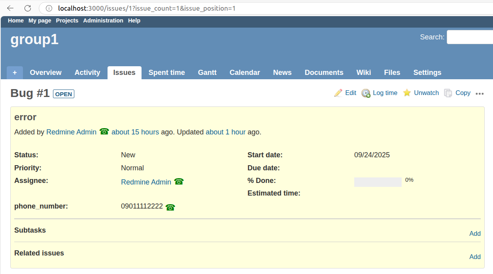
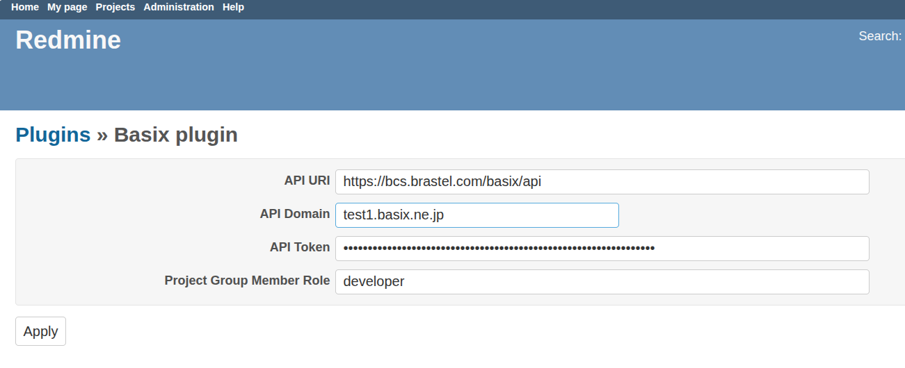

# redmine_basix

## Overview

This is a Redmine plugin for integration with Basix PBX.

It permits to initiate calls by clicking on phone icons that will show up in the issue pages:



It also converts urls for basix callrecording/voicemail wav and mp3 files in links to audio tags so that the files can be listened to without leaving the current page:


## Installation and configuration

To install it, do it as usual:
  - go to your redmine/plugins folder
  - clone this repo
  - restart redmine

 Ex:
```
  cd redmine/plugins/
  git clone https://github.com/brastelcloud/redmine_basix
```

To configure, go to http://YOUR_REDMINE_SERVER/settings/plugin/redmine_basix

and set values according to your account (contact Basix Support Center for details):
 


For this plugin to work, it is necessary that the users at Basix and Redmine have the same login name. 

So if your user name at Basix is 'john', your Redmine user login name should also be 'john'.

## Usage

To make calls, simply click on the phone icon near the name of the person you want to call.
This will make a call to your terminal and after you answer it (or after your terminal auto-answers the call), we will call that person.

You can also add a custom field phone_number in the issue element. 
If this field is filled, we will also add a phone icon for it and this will permit to make calls to that number.
The field can be filled with a fixed or mobile number like '0311112222' or '09033334444' but can also be filled with an extension number like '1234' or even a user name like 'john' (actually, any destination is valid).

Obs: in a planned future release we will allow to identify the corresponding user at the other system using the user email address.

This will permit for example to handle tickets for external customers and also to set the internal customer in case they don't use redmine.

If the current user is a member of the project group, calls will go out as group call which means:
  - for external calls (calls to PSTN, fixed or mobile number) the group calling_number will be used
  - for internal calls (calls to other users) the group name should show up in the callee terminal (OBS: this is not ready yet).

Otherwise if the current user is not a member of the project group:
  - calling the phone_number will not be allowed (no phone icon will appear for it)
  - clicking on the icon near the person's name will make a call to the group, not to that person.

## Uninstallation 

To remove this plugin just delete the folder redmine/plugins/redmine_basix
